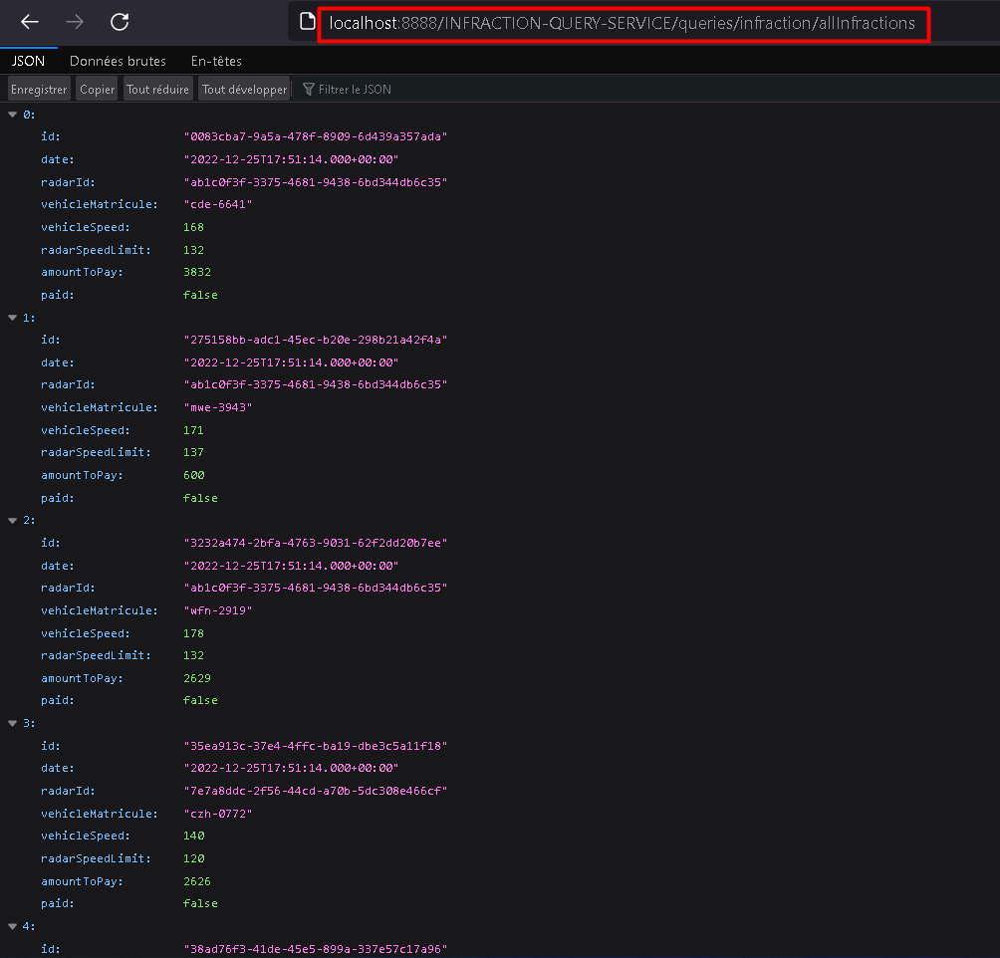
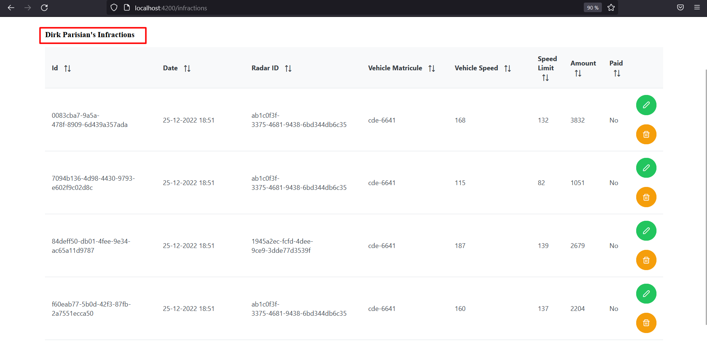

## Project : Management of traffic speed violations
### Context
We want to create a distributed system based on microservices using an event-driven architecture that follows the Event Sourcing and CQRS patterns. This application will be used to manage violations related to vehicles for speeding detected by automatic radars. The system consists of three microservices:

  - The microservice that manages the radars. Each radar is defined by its id, maximum speed, and coordinates: longitude and latitude.
  - The registration microservice that manages vehicles belonging to owners. Each vehicle belongs to a single owner. An owner is defined by their id, name, date of birth, email, and email. A vehicle is defined by its id, license plate number, brand, tax horsepower, and model.
  - The microservice that manages violations. Each violation is defined by its id, date, the radar number that detected the speeding, the vehicle's license plate number, the vehicle's speed, the radar's maximum speed, and the amount of the violation.

In addition to standard data consultation and modification operations, the system must allow for posting a speeding violation, which will result in a violation. Additionally, it must allow an owner to consult their violations.
The application is based on the Spring Cloud and AXON frameworks. Each microservice is decoupled into two independent parts: the command part and the query part of the microservice.
In addition to the modules representing the different microservices, the project uses a "core-api" module in the form of a Maven project that declares common components for the different projects such as commands, events, queries, DTOs, etc. In this module, you can work with Java or Kotlin.

### Project Architecture

### Class Diagram

### Radar mirco-service
#### Radar Commands

#### Radar Queries

### Immatriculation mirco-service
##### Vehicles

##### Owners

**Owner's vehicles**

### Infraction mirco-service

### Set up the technical services of the microservice architecture (Gateway, Eureka Discovery service)

### Angular application

### Secure your system with an OAuth2 authentication system such as Keycloak
### Write a docker-compose.yml script for deploying this distributed system in Docker containers

